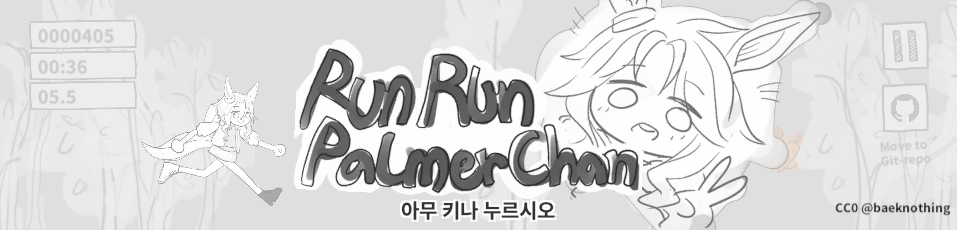

# runrun_palmerchan

## About the Project



This is a fan game I hastily put together after being deeply moved by the stories of Uma Musume and Mejiro Palmer(メジロパーマー). If you happen to come across this page, please remember Palmer chan. If you have the time, also consider playing Uma Musume; it's the best game. And if you could create a fanfic for Mejiro Palmer, I would be very grateful. We need more Mejiro Palmer content. 

This game is under CC0 license. It is completely open, and you are free to use it however you want. But, please keep in mind that this game is a derivative work of Uma Musume. 


## Built Info

[](https://unity3d.com/kr/unity/whats-new/2022.3.10)


## Getting Started

```bash
git clone https://github.com/BaekNothing/DobuCalculator
#open with Unity 2022.3.10f1
```


## Contributing

- 이 프로젝트는 버그리포트, 제안, 이슈 등 모든 형태의 기여를 환영합니다. 🤣
- The project welcomes all forms of contribution, including bug reports, suggestions, and issues.
